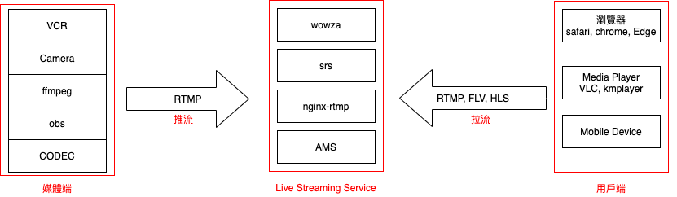

# 影音串流服務
`影音串流Streaming`跟一般靜態檔案加載最大的不同是串流可以逐塊加載並依據網速調整播放速度(adaptive bitrate streaming)

- `直播(Live Streaming)`
  - 是由某影音錄製器如IP Camera/監視器/錄影機等即時錄影並將影像串流導向多個用戶
- `影音串流VOD(Vedio On Demand Streaming)`
  - 是上傳靜態影片檔並經過處理，用戶觀賞影片並已串流方式分塊逐步下載而非完整檔案的技術。

### Live Streaming Protocol
- HLS
  - HTTP Live Streaming, 由蘋果公司提出的基於HTTP的流媒體網絡傳輸協議
- HTTP-FLV
  - FLV (Flash Video) 是Adobe 公司推出的另一種視頻格式，是一種在網絡上傳輸的流媒體數據存儲容器格式。其格式相對簡單輕量，不需要很大的媒體頭部信息。整個FLV 由The FLV Header, The FLV Body 以及其它Tag 組成。因此加載速度極快。採用FLV 格式封裝的文件後綴為.flv.
  - HTTP-FLV 即將流媒體數據封裝成FLV 格式，然後通過HTTP 協議傳輸給客戶端.
- RTMP:RTMP(Real Time Messaging Protocol)即時消息傳送協定是Adobe Systems公司為Flash播放程式和伺服器之間音訊、視頻和資料傳輸 開發的開放協議，共有五種變體
  - RTMP：此標準協定會運行在 TCP 協定上，並且使用埠1935；
  - RTMPS：RTMP 運行在 TLS/SSL 上。
  - RTMPE：RTMP 運行在 Adobe 自行定義的加密協定上。
  - RTMPT：使用 HTTP 將封包進行封裝以穿越防火牆；此時可以使用 RTMP, RTMPS 或 RTMPE。
  - RTMFP：RTMP 運行在 UDP 上。
- RTSP:
  - Real Time Streaming Protocol (RTSP)
- WebRTC
  - 網頁即時通訊(Web Real-Time Communication)，是一個支援網頁瀏覽器進行實時語音對話或影片對話的API。
### 架構圖 (wowza 範例)
  

### 備註
- ffmpeg 可以同時拉流, 推流. 所以可視為媒體端和用戶端
- [各家RTSP格式](https://mofulls.pixnet.net/blog/post/359930523-%E5%90%84%E5%AE%B6rtsp%E6%A0%BC%E5%BC%8F)   
